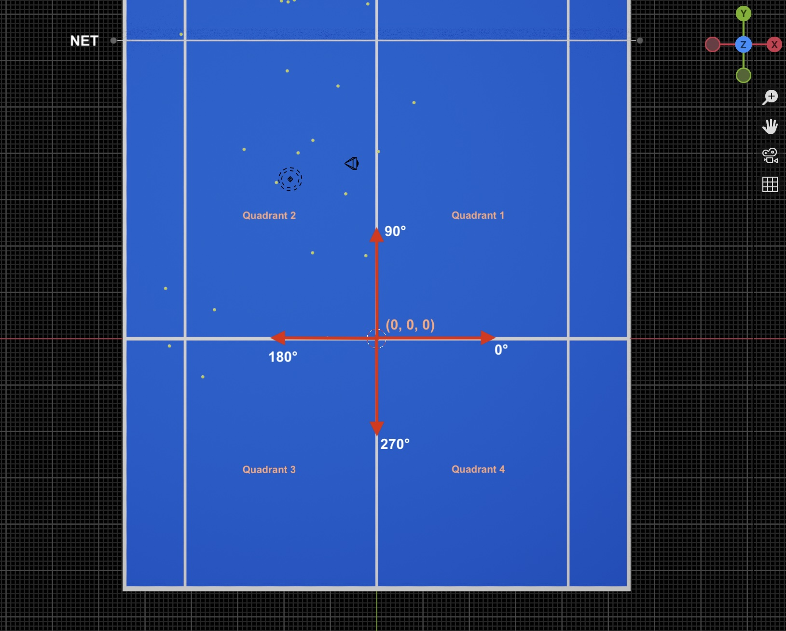

# ECE4191_T26
Tennis Ball Collecting Robot Code &amp; Programming

Timeline:
-
Week 1:
- Have a clear concept design
- Pick a microprocessor / programming environment

Week 2:
- Drive motor thru code at variable speeds
- Achieve forward / rotate drive

Week 3:
- Drive with basic odometry (feedback control from shaft encoders, motion model estimating relative robot position)

Friday 4:30pm - Proposal Due

### World Coordinate System

